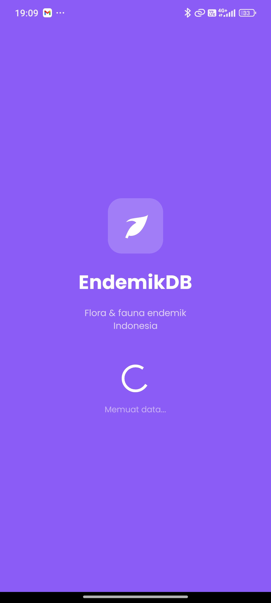
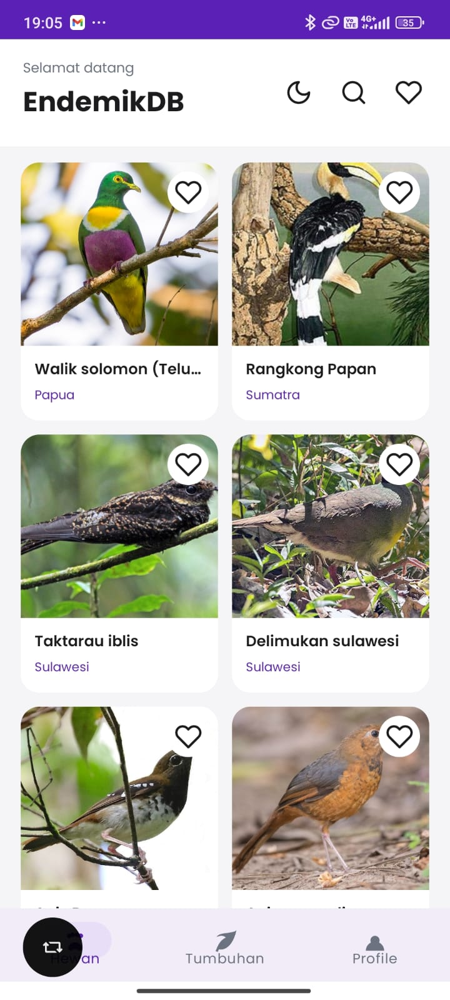
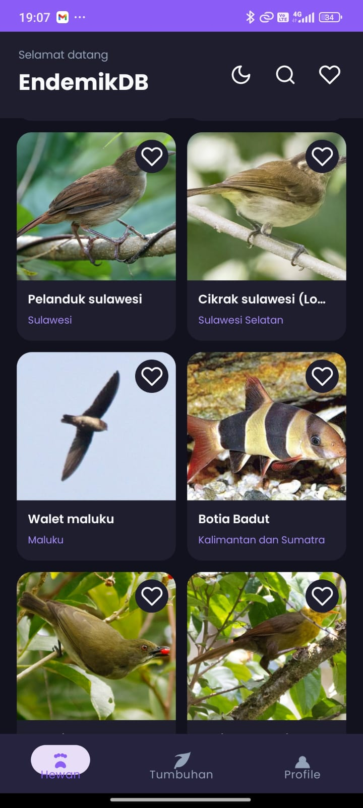
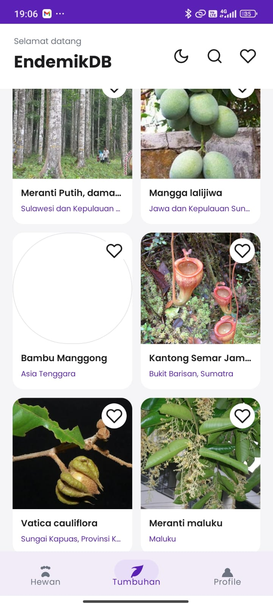
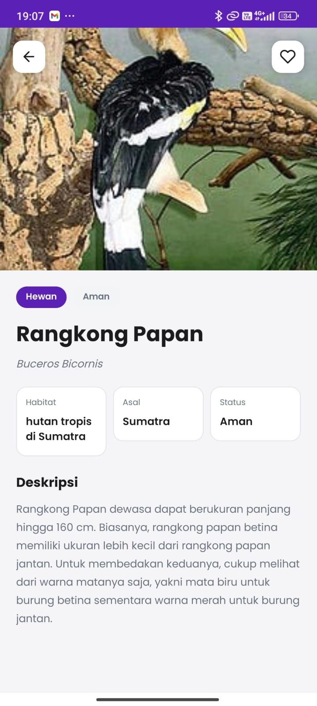
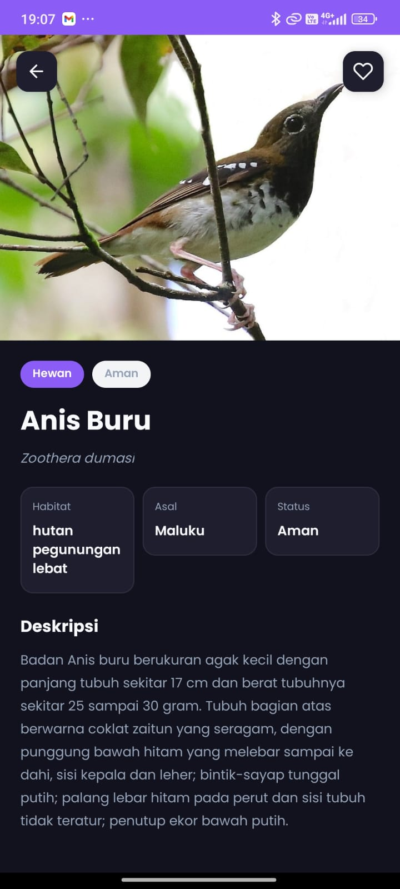
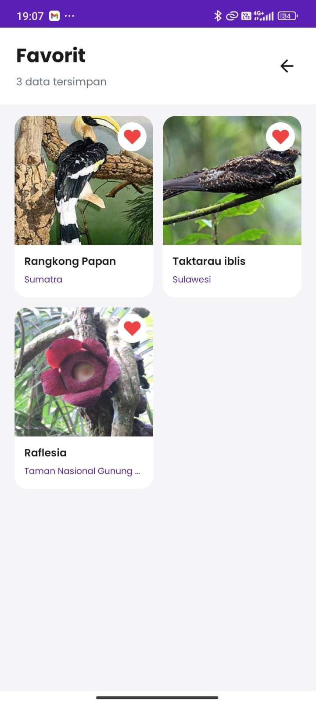
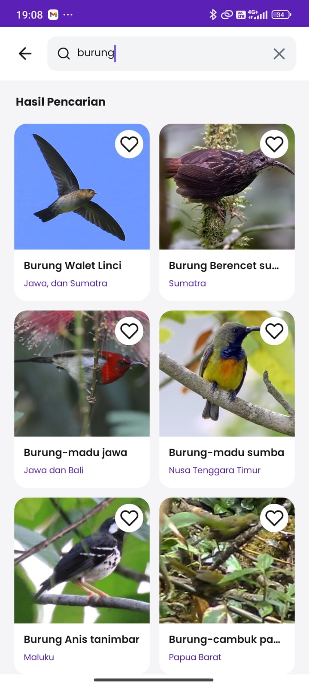
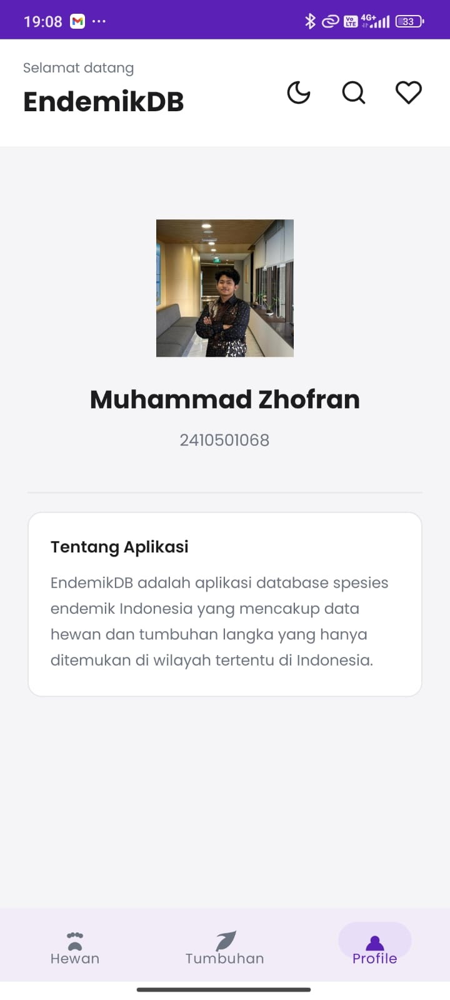
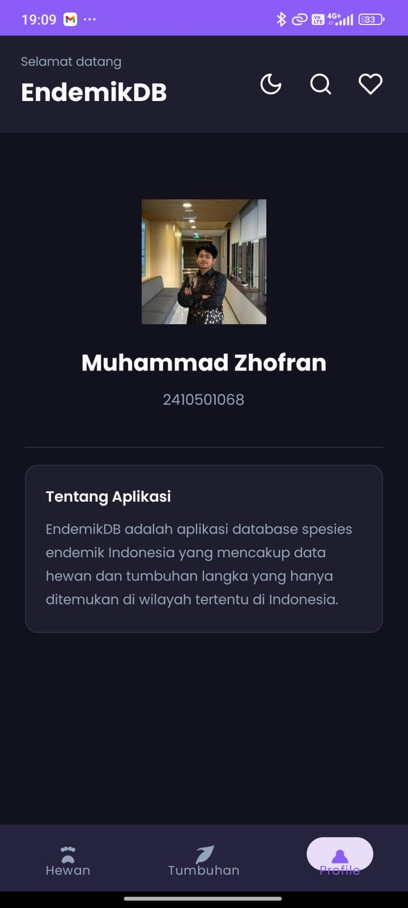

# EndemikDB

## Informasi Mahasiswa
- **Nama** : Muhammad Zhofran
- **NIM**  : 2410501068

---

## Tentang Aplikasi

EndemikDB adalah aplikasi mobile database spesies endemik Indonesia yang mencakup data hewan dan tumbuhan langka yang hanya ditemukan di wilayah tertentu di Indonesia. Pengguna dapat menjelajahi data endemik, mencari spesies, menyimpan favorit, dan melihat detail lengkap setiap spesies.

---

## Tech Stack

- Java (Android Native)
- Android Studio
- Room Database (local storage)
- Retrofit 2 (API client)
- Glide (image loading)
- ViewModel & LiveData
- Material Design 3

---

## Fitur

- Daftar hewan endemik Indonesia
- Daftar tumbuhan endemik Indonesia
- Pencarian spesies dengan riwayat pencarian
- Simpan spesies favorit (offline)
- Detail lengkap tiap spesies
- Dark mode support
- Halaman profil mahasiswa

---

## Cara Menjalankan

### 1. Clone Repository
```bash
git clone https://github.com/Zhofran27/EndemikDB
```

### 2. Buka di Android Studio
File → Open → pilih folder project

### 3. Sync Gradle
Klik **Sync Now** jika muncul notifikasi

### 4. Jalankan Aplikasi
Colok HP via USB + aktifkan USB Debugging, lalu klik tombol ▶️ Run

---

## Screenshot Preview

<p>
  
  
  
  
  
  
  
  
  
  
  
</p>

---

## Arsitektur

Aplikasi menggunakan pola **Repository Pattern** dengan komponen:

- **UI Layer** : Activity & Fragment
- **ViewModel & LiveData** : state management
- **Repository** : single source of truth antara API dan database lokal
- **Room Database** : penyimpanan data favorit secara offline
- **Retrofit** : pengambilan data dari REST API

